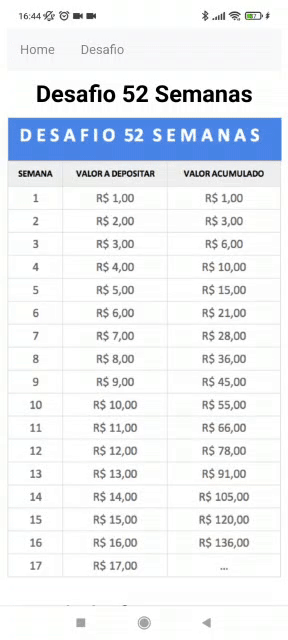

<h1 align="center">Desafio 52 semanas</h1>

### Como funciona o Desafio das 52 Semanas

<p>De maneira simples, o desafio 52 semanas é uma técnica para poupar dinheiro mesmo ganhando pouco.</p>

<h4 align="center"> 
	🚧  React Select 🚀 Em construção...  🚧
</h4>

### Demonstração da aplicação

<p align="center">
  
  
</p>

Clique [aqui](https://cardoso0.github.io/52-semanas-react/) para visualizar o projeto no seu navegador

### 🎲 Rodando o projeto na sua maquina

```bash
# Clone este repositório
$ git clone https://github.com/cardoso0/52-semanas-react

# Instale as dependências
$ npm install

# Execute a aplicação
$ npm run dev

```

### 🛠 Tecnologias

As seguintes ferramentas foram usadas na construção do projeto:

- [HTML](https://www.w3schools.com/html/)
- [CSS com Styled Components](https://styled-components.com/)
- [React](https://pt-br.reactjs.org/)

### Autor
---
Feito com ❤️ por Felipe Cardoso 👋🏽 Entre em contato!

[](https://www.linkedin.com/in/felipe-pontes-cardoso-9b93401a0/) 
[](mailto:felipepontescardoso@yahoo.com.br)
